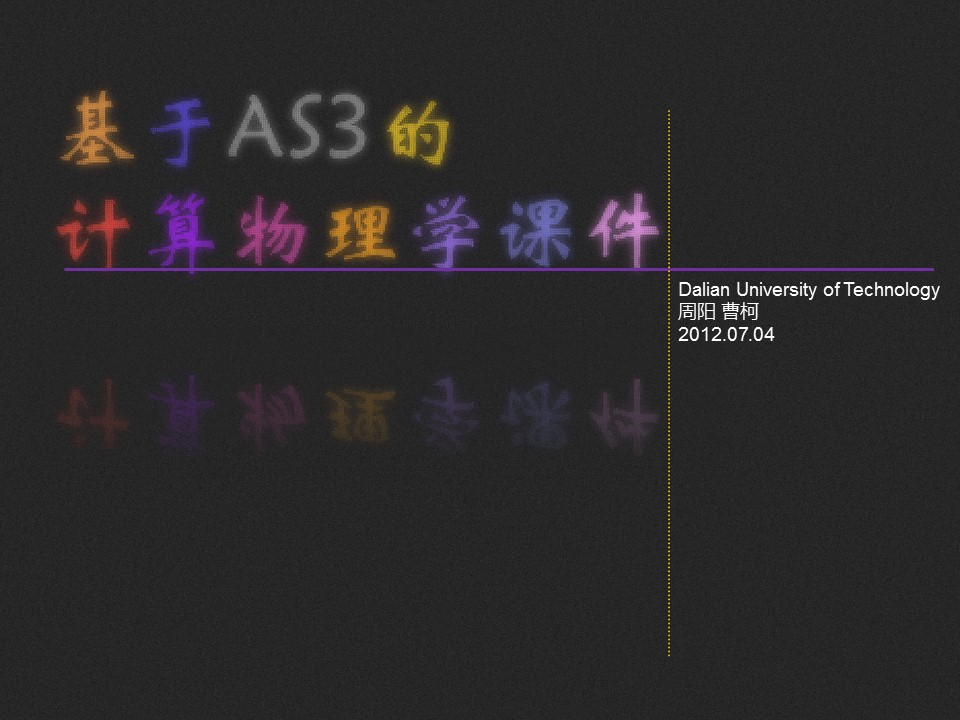
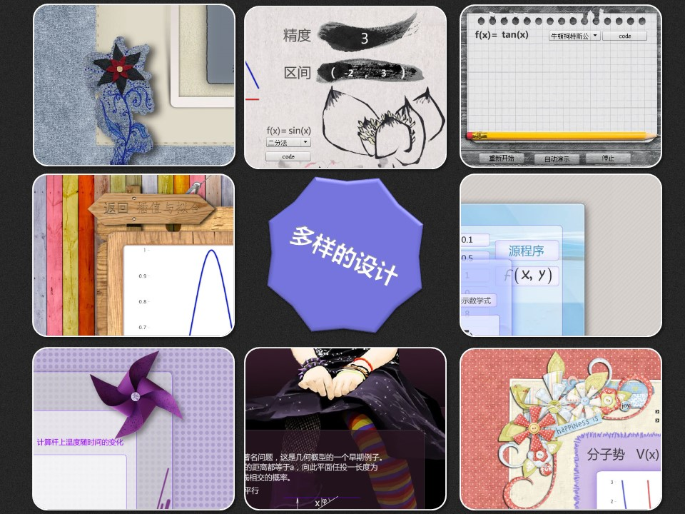
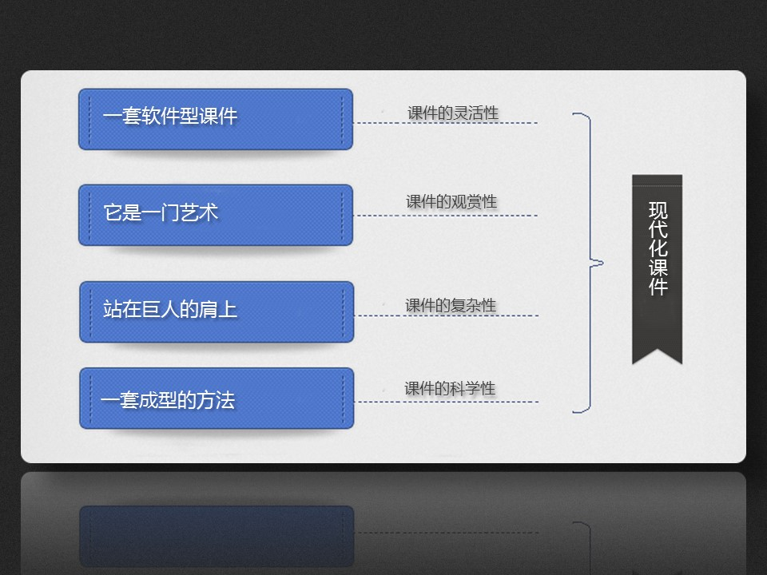
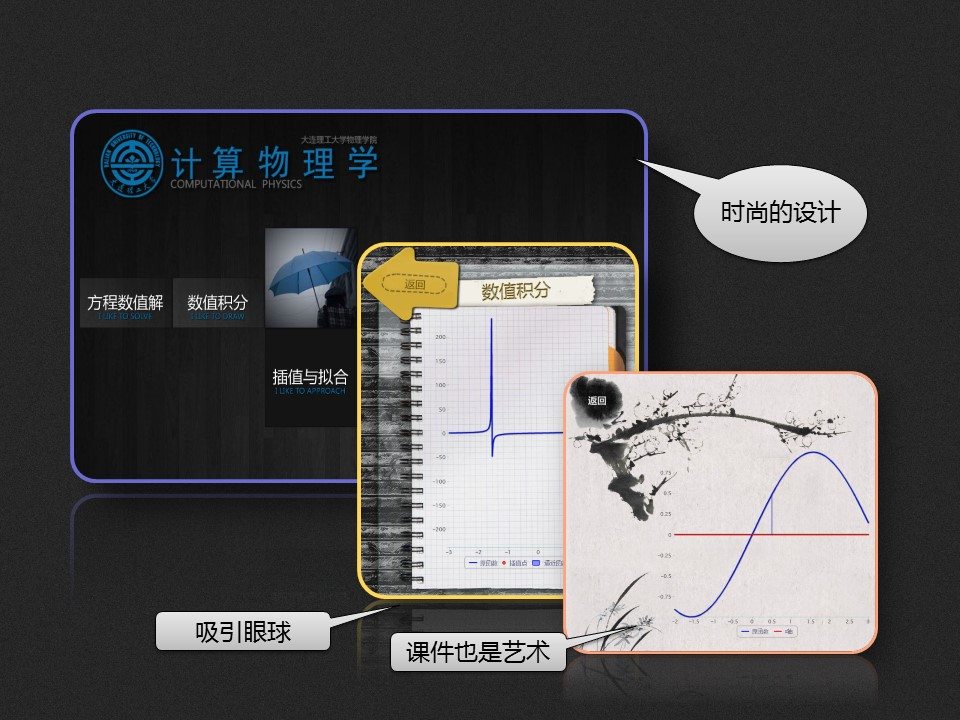
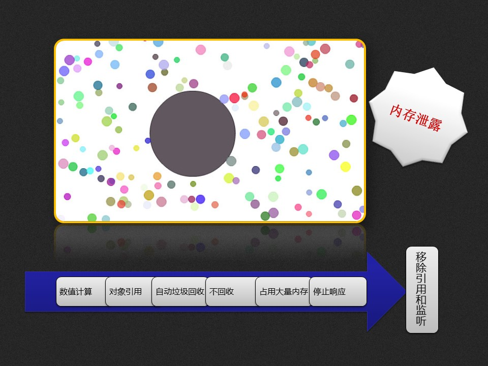

# Numerical Experiments Computer Aided Instruction
A desktop software to help student of **Computerational Physics** to study numerical algorithms from visual.
> @Authour Yang Zhou

> @Mail  y_zhou13@fudan.edu.cn

> @Fudan University Computational Condensed Matter Group(CCMG)

# Summary

## What

- 使用现代化的编程语言AS3写出的课件,而非网络上基于动画的随处可见的FLASH课件，

- 利用AS3，我们可以实现FLASH中的数学作图，动力学过程的模拟甚至分子动力学模拟，能够细致地演示物理学中的概念

## Introduction 

将物理学课件以软件的形式制作早已不是新鲜事，你可以在网络上搜索到物理学仿真模拟软件、力学实验室软件，但它们大多是用VB、C++或是Java写成，这些语言本身的学习就很复杂，它们的GUI设计更难学习。对VB我深有体会，它在数组操作上非常不便，对界面的优化需要调用Windows的库函数，想要画一个像样的函数图像比登天还难。曾经我还想过使用HTML结合JAVASCRIPT制作课件，虽然这种方法语法明晰，库函数满天飞，但布局十分困难，且按钮等元素难以更改外观，最重要的是课件需要的效果几乎只有google chrome等新一代浏览器才能查看，而网上大多数用户使用的是ie6，使得开发难度极其巨大。另外，课件几乎总是全屏使用，这使得分辨率无关性尤为重要，可以说，要实现这一点，使用以上这些编程工具是根本不可能的。

课件本身讲求的可视化程序高，美观漂亮，易于制作，易于扩充，使用方便，分辨率无关等性质几乎就是FLASH的优点，所以说，在FLASH上编程制作现代化的课件是多媒体课件发展的必然趋势。同时随着基于FLASH的AIR技术迅速发展，我们可以自由地在网络课件和桌面课件间自由切换，这片天地畅游无阻！

基于这些理由我们选择FLASH结合AS3制作一个计算物理学课件。计算物理学是一门算法课，使用了大量生涩的符号，算法的推导不直观，且算法与程序之间相差很远，为它制作一个课件太有必要了。我们的课件本着功能强大、完善，界面赏心悦目，紧随时尚，同学们喜闻乐见的想法制作。

设计之初我们解决了素材搜索问题以及数值算法设计的问题，通过网络搜索图片，PS处理和优化或是PS直接绘制等手段完成素材制作过程。可以说最难的不是素材有多难找，而是怎样合理地组织，使课件赏心悦目。最初我们想过统一风格，完全使用主页上典雅的蓝黑风格。然而，做课件，参加比赛都比不上锻炼自我来得重要，为此我们挑战自己，每一个版块各设计一个界面，克服界面设计上的困难，找出一套方案使这一切变得更加轻松和有条理，最终我们做到了。

先做功能，再做界面，这显然是MVC的核心。这次我们是反过来，有悖了程序设计的原则，但这是事后诸葛。作为一种探索，我们发现在FLASH中制作课件可以有两种模式，一是像“常微分方程”等几个模块中使用的集中模式，使用一个组合框选择功能，在同一个界面上操作；另一种是“偏微分方程”等几个模块中使用的子课件模式，也就是每个功能放在一个小画布上，点击写有它们名字的按钮将它们显示出来。现在很明确后一种方法来得更为高效，并且与FLASH的帧结构配合得很好，而前一种方法需要配合MVC设计模式才可能推广。

任何一个GUI程序都是由组件构成的，有的可以只有一个窗口一个按钮，而我们的课件需要

- 作图控件

> 它能画多个系列，各个系列能分别控制，能有个LEGEND，能自适应坐标，作图时有动态效果，系列更改时可以平滑地从原数据过渡到新数据，能作线状图，散点图，面积图，必要时还应加上像素图，等高图等。这个控件完全由我自己写，界面上仿照了highcharts。

- 表格控件

- 文本框控件

> 需要能改变皮肤

- 下拉框

> 用于选择算法

- stepper

> 用于鼠标点击使数值加减1

- 一个三维作图控件

> 因为水的表面波部分需要使用，这个控件也是我自己写的。

- 数学表达式解析控件

> 没有这个就不能自由设定函数

- Mathml显示

> 用于将数学式转化为打印体（在常微分方程版块里有所使用），分为转化和渲染两部分，转化部分由我自己写成，渲染部分使用了网络上的库函数。

使用FLASH的优点也在于它提供了很多像样的控件。

但是这些控件的使用也是有限制的。课件制作的初期我们把每一个模块制作在一个FLA源文件里面，对每一个分别进行分辨率优化及居中设定，然而将主页与各个模块通过swf载入的企图是失败的，因为FLASH一再提示组件类重复定义，需要覆盖，选择覆盖或不选择都将使课件无法正常运行，因此最终将模块制作在同一个源文件中，使用帧跳转结构进行联系。在这个阶段我们还想添加过渡特效，然而由于时间所限，就此打住。

然而FLASH的控件并非VB那么顺手，比如，编辑完一个文本框后点击窗口，它不会失去焦点，修改也就不能立即应用。在这里我们遇到了较大的麻烦。困难的地方都是那些不起眼的地方，然而就因不它不起眼，你的进度规划里才少了它，所以这使得时间很紧。

解决了控件问题后主要的精力就集中在演示的算法上，比如线性方程组模块中的列主元消去法需要设计矩阵显示，控制文本运动，为了添加上一步和下一步命令需要使用命令模式，这些比数值算法本身困难许多。在常微分方程模块中打点与文本更新的协调问题也被我们一一解决。

最后的问题出现在水的表面波模拟，布朗运动模拟上，它们属于大规模数值计算，在运行后如果切换到别的模块，它们依然在后台运行，占用大量内存，而FLASH的垃圾回收无法及时处理，将导致课件瘫痪。为此我们研究了手动回收，并成功解决了这个问题。

终于，我们的课件完成了，很累，但是学到很多东西，我们知道了，有些事你必须拼命才能做好，有些事，你拼命也能做不好，必须站在别人的肩膀上。我们知道了探索是一件艰辛而快乐的事，合作和成功都是幸福的事。

展望：

FLASH推出了用于数值计算的ALCHEMY模块，以及用于3D的GPU解决方案，使用这些我们可以让我们的课件更加强大。
