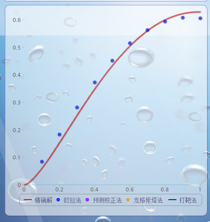

# Manual

> @ 课件名称：基于AS3的计算物理学课件

> @本课件制作：大连理工大学物理与光电工程学院 0902班周阳

> @联系方式：手机13555913912 邮箱404422239@qq.com

> @数学科学学院1001班 曹柯

> @指导教师：大连理工大学物理与光电工程学院 戴忠玲副教授

> @制作工具：FLASH CS5.5 AS3

> @ 引用的成果：公式解析器，MathML渲染器，TweenMax缓动类，一个流体力学模拟课件

## Advances

- 功能强大、完善，界面赏心悦目
- 能适应各种分辨率
- 平台要求低（大小只有10M左右，但代替了matlab课件，如果你愿意，完全可以放在网页上）

## Features

- 程序结构严谨，用面向对象的方法写成，在必要的地方使用了设计模式。
- 处理了点击窗体后文本框不失去焦点的问题。
- 合理地垃圾回收，保证课件的大计算量不会导致运行缓慢。
- 自写了ASCII码数学表达式转化为MathML编码类，用以将1/(x^2+1)等转化成MathML以渲染输出。
- 自写了一个二维作图类（仿照了一个jQuery作图库highcharts,有兴趣的朋友可以看看）

## Contents

本课件用于计算物理课程的教学，包括

- 常微分方程
- 偏微分方程
- 非线性方程
- 数值积分
- 插值与拟合
- 线性方程组
- 分子动力学
- 蒙特卡罗模拟

八个版块，每个版块采用一个界面，每个版块又各有若干小内容，包括了计算物理课程的所有内容，具有强大的交互能力，可以调动学生的学习热情。

## Usage

1. 点击exe图标

 

- 进入课件主界面，并转为全屏显示，点击左上角可切换全屏与窗口

 
 
 
## 各版块详解：

1. 常微分方程

	
 
	改变f(x,y)的表达式，再单击显示数学式按钮可输出教科书形式的公式
	点击源程序按钮下面的f(x,y)可以在之后调出这个面板。
	
	

	所有这些数值都是可以改变的，以实现计算区间的调整，其余版块也是如此，概不多说。

	

	点击源文件按钮可查看相应的matlab源码，请复制到其他文本编辑器阅读。其他各版块也有相应源代码。

	
	 
	通过这些按钮可以控制计算演示

	
	 
	这个按饼钮可以让你选择数值计算的方法

	
	 
	点击下面的legend按钮可以隐藏相应的函数系列，可以看到图像变化很有动感。

- 线性方程组
 	
	

	系数矩阵面板可以自己输入，也可以通过示例按钮选择提供的例子，方程的求解将以矩阵的形式进行。
 	
	

	 
	在列主元消去法中，以红色标出列主元，每一步会把主元交换到相应的行。
 	
	
	 
	LU分解法中将L矩阵和U矩阵列在一起，请仔细观察，以识别出这两个矩阵
 	
	
	 
	其余三种方法是迭代方法，要求系数矩阵满足一定的条件才能收敛，示例的前两个满足条件，其余的不满足。
	
	指出了这些，你基本上可以很容易使用这个课件，下面再指出一些你可能忽略的功能。
 	
	
	 
	在分子动力学版块中这个流体力学模拟是可以用鼠标控制的哦
 	
	

 
	各个函数都是可以更改的，改完之后不能直接按ENTER，而要点击其他地方能才应用这个更改，注意没有exp函数哦，这里要用e^x来表示这个函数。

... ...

好了，就到这里吧，have fun!
